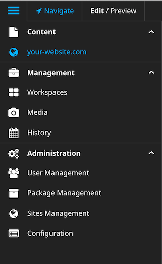

.. _default-modules:

=====================
Default NEOS modules
=====================

In order of appearance from top to bottom, the following modules are available in a default installation of NEOS 2.x.x:

#. Content section, showing each enabled Site as a list entry
#. Management section, providing the modules
 #. Workspaces
 #. Media
 #. History
#. Administration section, providing the modules
 #. User Management
 #. Package Management
 #. Sites Management
 #. Configuration

Content section
---------------

The content section lists all "Sites" available (i.e. activated) in the current NEOS instance.
Clicking a site name reloads the backend and switches to the respective site, thus enabling editing of the selected site.

Management section > Workspaces
-------------------------------

This module contains the overview of all elements within the current workspace and it enables to continue the review and publishing workflow for them.

Management section > Media
--------------------------

This module allows managing of media assets including pictures, videos, audio and documents.

Management section > History
----------------------------

This module provides an overview of all relevant events affecting this Neos installation.

Administration section > User Management
----------------------------------------

The User Management module provides you with an overview of all backend users. You can group them by their properties so you are able to monitor their permissions, filemounts, member groups etc.. This module is an indispensable tool in order to make sure the users are correctly configured.

Administration section > Package Management
-------------------------------------------

The Package Management module provides you with an overview of all packages. You can activate and deactivate individual packages, import new packages and delete existing packages. It also provides you with the ability to freeze and unfreeze packages in development context.

Administration section > Sites Management
-----------------------------------------

The Sites Management module provides you with an overview of all sites. You can edit, add and delete information about your sites, such as adding a new domain.

Administration section > Configuration
--------------------------------------

The Configuration module provides you with an overview of all configuration types.
